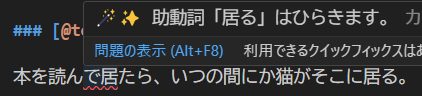

# カスタム日本語校正


[textlint](https://github.com/textlint/textlint)を用いて、VS Code上でテキストファイル（Markdown、HTML、LaTeX、Re:VIEW含む）の日本語の文章を自動校正する拡張機能です。

正規表現が使える[prh](example/all-rules.md#prh)パッケージや、形態素解析の結果が使える[textlint-rule-morpheme-match](example/all-rules.md#textlint-jamorpheme-match)パッケージをサポートしており、柔軟な校正ルールの設定が可能です。



## 使い方

[拡張機能のインストール](https://marketplace.visualstudio.com/items?itemName=knttnk.custom-japanese-proofreading)後、テキストファイルを開くと自動で文章のチェックが行われます。

対応しているテキストファイルは以下の形式です。

- テキストファイル（`.txt`）
- Markdownファイル（`.md`）
- HTMLファイル（`.html`）
- Latexファイル（`.tex`）
- Re:VIEWファイル（`.re`）

## 設定

settings.jsonは次のような見た目になります。

```json
// .vscode/settings.json
{
    "customJapaneseProofreading.textlintrcPaths": [
        "./.vscode/.textlintrc.json",
        // ":default:"
    ],
    "customJapaneseProofreading.checkOn": "save",
    "customJapaneseProofreading.maxNumberOfProblems": 100,
}
```

### `checkOn`

校正を行うタイミングを指定します。

- `"save"`: ファイルを保存するたびに校正を行います。
- `"change"`: ファイルを変更するたびに校正を行います。

### `maxNumberOfProblems`

表示する問題の最大数を指定します。デフォルトは`100`です。

### `textlintrcPaths`

校正に使用するtextlintrcファイルへのパスを指定します。
複数のパスを指定できます。

特殊な値があります。

- `"./"`は、ワークスペースのルートディレクトリを指します。
- `":default:"`は、デフォルトの設定ファイルを指します。これは、テキスト校正くんのデフォルト設定ファイルになっていると思います。

#### textlintrc ファイル

設定ファイルの書き方は、[textlint/.textlintrc](https://github.com/textlint/textlint?tab=readme-ov-file#textlintrc)を参照してください。
ただし、textlintrcは本来色々な形式で書くことができますが、この拡張機能では**JSON形式で書き、拡張子もファイル名に含める**ことを推奨します。

サポートしているルールの一覧は、 [all-rules.md](example/all-rules.md) を参照してください。

## 謝辞

この拡張機能は、[テキスト校正くん](https://github.com/ics-creative/project-japanese-proofreading)のv0.1.6をベースにしています。
テキスト校正くんの開発者の方々に感謝を申し上げます。
